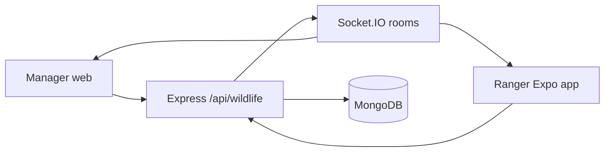

# Architecture — Member 4 wildlife monitoring

The HTTP server in `backend/src/server.js` is unchanged apart from mounting `/api/wildlife` and registering wildlife socket rooms. Field-incident broadcasts still go to every connected socket.

## Collections

- `WildlifeAnimal` — collar subject. `animalId` is unique. `lastLocation` is a GeoJSON point.
- `TrackingSensor` — `GPS_COLLAR` or `CAMERA_TRAP`. Optional link to an animal.
- `ProtectedZone` — park polygon, high-risk polygon, or village reference point.
- `SensorTelemetry` — each simulated fix. `simulationFlag` is true for demo writes.
- `WildlifeAlert` — one open incident per `dedupeKey` while status is active.
- `FieldResponseUnit` — named team, ranger, availability, and point.
- `DispatchOrder` — one active order per alert, with an idempotency key.
- `WildlifeAuditLog` — actor, entity, action, previous state, new state.

Alert status moves `NEW → ACKNOWLEDGED → RESPONSE_DISPATCHED → IN_PROGRESS → RESOLVED`, with `CANCELLED` from the early states. `ANIMAL_RETREATED` is allowed only from `NEW` or `ACKNOWLEDGED` and only when no dispatch exists.

Dispatch status moves `ASSIGNED → ACCEPTED → IN_PROGRESS → COMPLETED`.

A ranger may read and update only dispatches whose `assignedRanger` is that user. Managers and admins acknowledge, resolve, and create dispatches.

## HTTP API

Prefix: `/api/wildlife`

- `GET /overview`
- `GET /animals`, `GET /animals/:id`, `GET /animals/:id/telemetry`
- `GET /sensors`, `GET /sensors/:id`
- `GET /zones`
- `GET /alerts`, `GET /alerts/:id`, `GET /alerts/:id/audit`
- `PATCH /alerts/:id/acknowledge`, `PATCH /alerts/:id/resolve`
- `GET /response-units?longitude&latitude&radiusKm`
- `GET /dispatches`, `POST /dispatches`, `GET /dispatches/:id`
- `GET /my-dispatches`
- `PATCH /dispatches/:id/accept|start|progress|complete`
- Development only: `POST /demo/reset`, `POST /demo/scenarios/:code`, `POST /demo/playback`, `GET /demo/log`, `POST /demo/sensors/:id/status`
- Public simulated frame: `GET /demo-assets/camera-trap.svg`

Lists accept `page` and `limit`. Unknown ids that are not a 24-character hex value or a `WA-` / `DP-` code return 400.

## Realtime

Clients send the JWT in `socket.handshake.auth.token`.

- Managers and admins join `wildlife:managers`.
- Each user joins `wildlife:ranger:<userId>`.
- Events: `wildlife:location-updated`, `wildlife:alert-created`, `wildlife:alert-updated`, `wildlife:sensor-offline`, `wildlife:dispatch-created`, `wildlife:dispatch-updated`.

The web dashboard and the phone home screen refetch after an event and after reconnect. Listeners are removed on unmount. REST still loads the same records if the socket is down.

## Web and mobile sync

Both clients call the same API and the same MongoDB records.

The phone queues accept, start, progress, and complete actions in AsyncStorage under `@offline_wildlife_ops` when NetInfo reports offline. Each item has an `operationId`. Retry runs from the existing sync service. A queued item stays visible as pending until the server accepts it.

The phone map is a React Native view of OpenStreetMap tiles around the alert. It uses `expo-location` while that screen is open. If permission is denied, it shows a labeled demo point near Yala. It does not track in the background.
